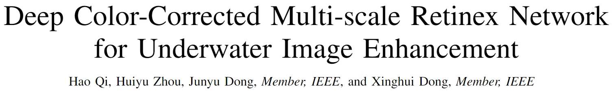
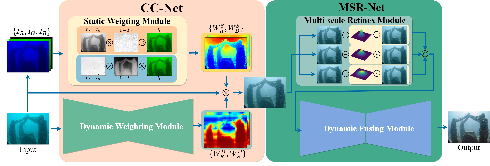
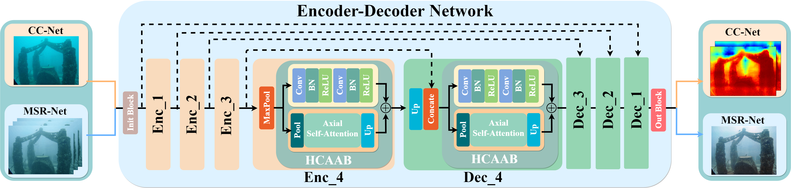
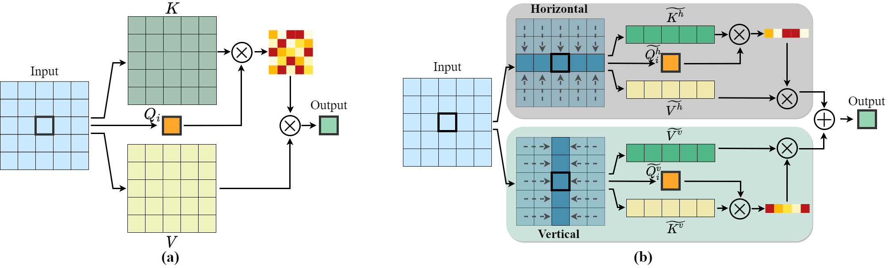
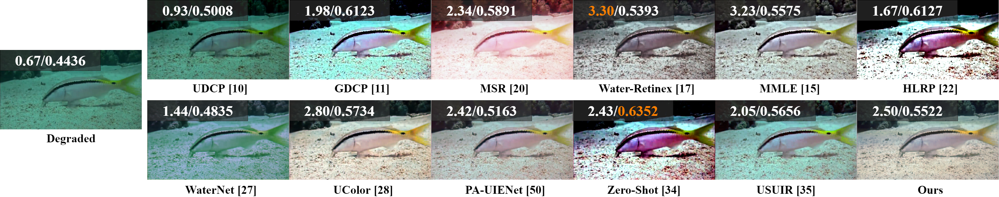
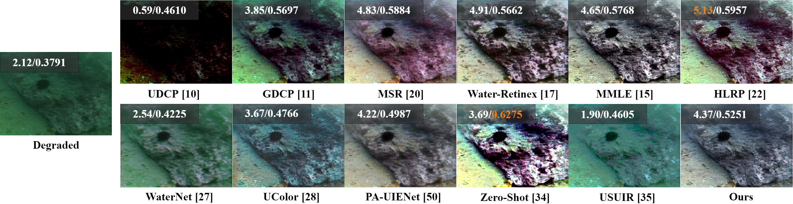

 

# Architecture

## Shared Encoder-Decoder Network

## Lightweight Axial Self-Attention

# Usage
### Installation:
1. Create the environment from the <kbd>environment.yml</kbd> file:

        conda env create -f environment.yml

2. Activate the new environment:

        conda activate uie

3. Verify that the new environment was installed correctly:

        conda env list

You can also use <kbd>conda info --envs</kbd>.

# Results

